# Create API Time Challenge

## Description
Create an API that can be used to: 
1. Find out the number of days between two datetime parameters.
2. Find out the number of weekdays between two datetime parameters.
3. Find out the number of complete weeks between two datetime parameters.
4. Accept a third parameter to convert the result of (1, 2 or 3) into one of
seconds, minutes, hours, years. 
5. Allow the specification of a time zone for comparison of input parameters from
different time zones.

## Installation
In order for this application to work the user must first clone the app from GitHub. 
Once the repo has been cloned, the command terminal must be opened, and the user must input 
"npm install", this will allow the dependencies (express and nodemon) to be installed. 

Next, in the terminal enter "nodemon server.js" to start and connect the localhost server.  
Note, localhost is :5000 

Once the user has completed the installation steps they can test out the application using POSTMAN or cURL. If postman needs to be downloaded you can click on this link to download and install [Install Postman](https://www.postman.com/downloads/)

Alternatively, other applications that are used for API testing can also be used (such as insomnia). 

## Usage
Assuming the installation has been successful, the connection to local host (using nodemon server.js in terminal command) is complete, we can now use the application. 

The routes we will be using are:  
http://localhost:5000/daysbetween  ( Find out the number of days between two datetime parameters)  
http://localhost:5000/getweekdays (Find out the number of weekdays between two datetime parameters) 
http://localhost:5000/completeweeks (Find out the number of complete weeks between two datetime parameters)

For demonstration purposes we will be using postman to explain the usage. 

In postman, select 'file' from the drop-down menus, select 'new' and select HTTP Request, this will allow for testing of routes. 

We can now begin to test our routes. 

To find out the number of days between two datetime parameters. Replicate the following image in postman, making sure the URL is correct: http://localhost:5000/daysbetween

It is important to make sure the "Body" is selected, "raw" is selected and "JSON" is selected. 

The user can enter dates in the body, and it will output the days between the two date parameters, for example:

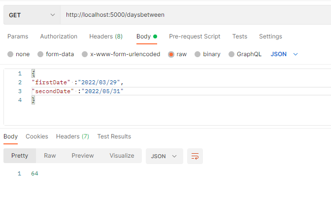

A third parameter "units" can be added to the body which will output the time between the two date parameters in either seconds, minutes, hours, or years. 

For example, to see how many seconds are between the two date parameters (March 29th 2022 to April 2nd 2022)

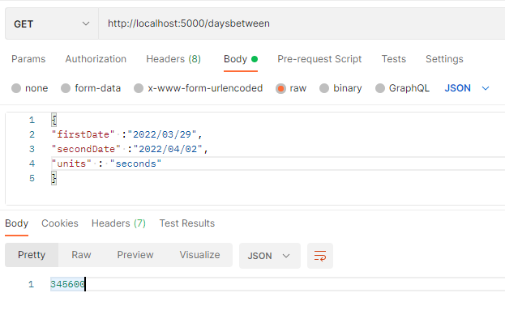

Different measure of time can be used by switching seconds to minutes, hours, or years. 

For example, hours: 

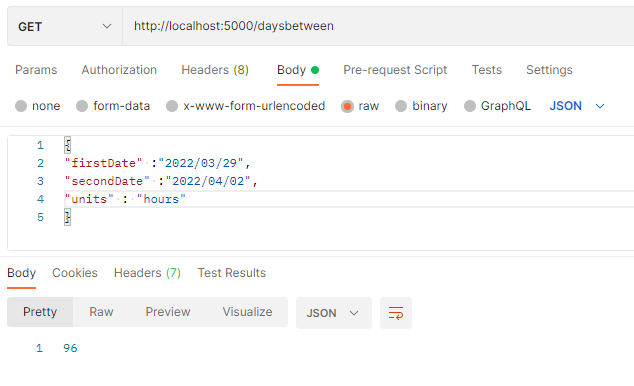

The same principles can be applied to the other routes. 

To see the number of weekdays between two dates, follow the same steps as above, however, the URL needs to be changed. 

To view weekdays the URL must be http://localhost:5000/getweekdays

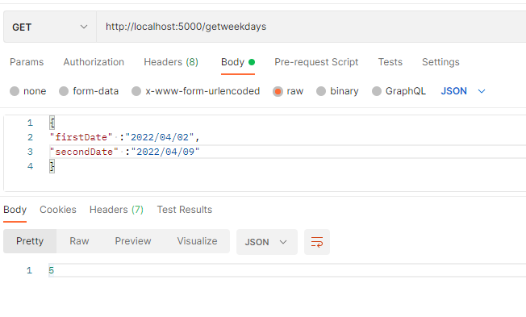

Again we can include unit of time, i.e. how many minutes. 

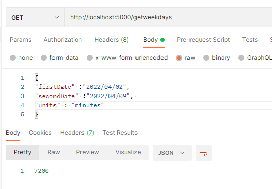

To view the number of complete weeks between 2 dates we simply change the URL to: http://localhost:5000/completeweeks
When can then select the dates as well as a unit of time (seconds, minutes, hours or year) if desired. 

For example, how many weeks; 

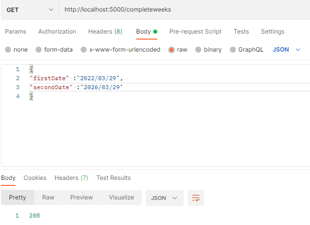

Or units of time can be added, such as years. 

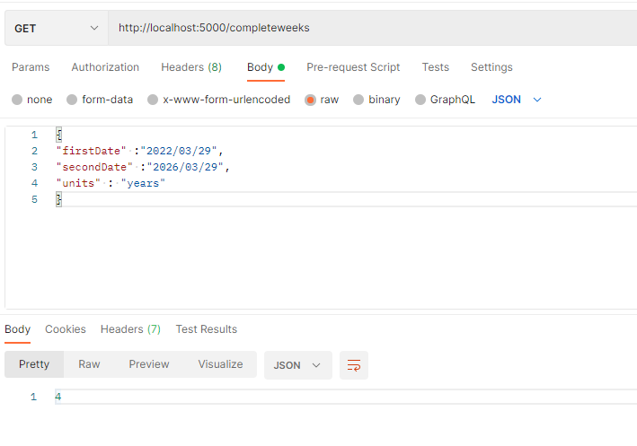

Allowing the specification of a time zone for comparison of input parameters from different time zones can be achieved by adding time and UTC to end of the date input. 

[Click here to find a full list of UTC times](https://en.wikipedia.org/wiki/List_of_UTC_time_offsets?fbclid=IwAR0yXR3bN4bMMMdlYFXZS35XuFCoDtF7ZIz6k9M7wwdrp97Hi277vIH1NCg#UTC%E2%88%9212:00,_Y)

For example 
The first time zone may be Arizona (10:30am) in the USA which is UTC-08:00 and second time zone might be South Australia (10:30am) in Australia which is UTC+09:30 

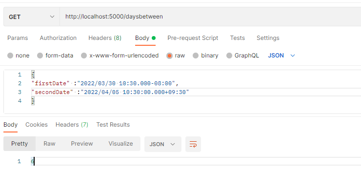

Again, units of time can be used by adding a third parameter. 

Note: If the connection has been established to localhost, we can also use curl commands in the command line to get the same results as in postman. 

For example: to figure out how many seconds are between weekdays for two dates replicate the following image. 

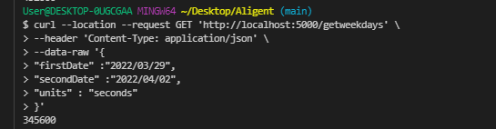

Another example: How find out how many complete weeks are between two dates, replicate the following image then select enter. 

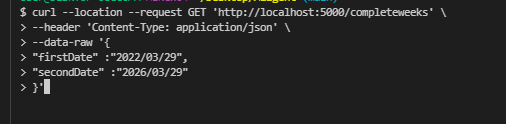

Lastly, to allow for the specification of a time zone for comparison of input parameters from different time zones, then select enter. 

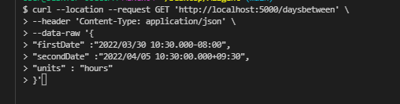
